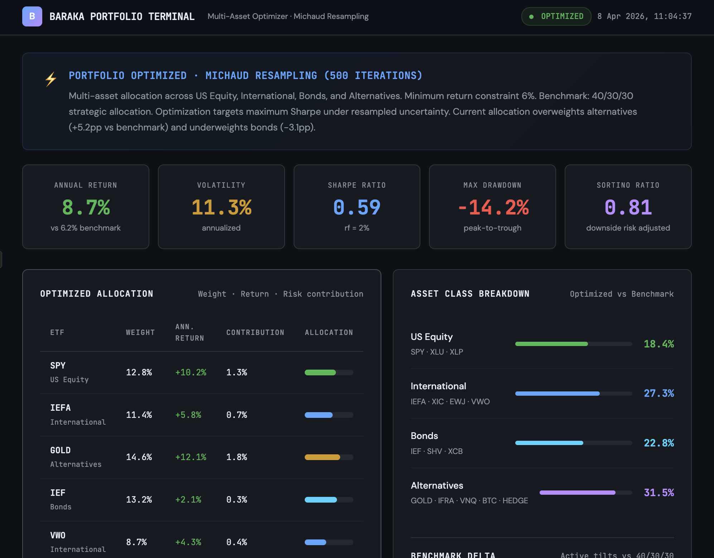

# Baraka Portfolio Terminal

**Multi-asset portfolio optimizer** with Michaud resampling, stress testing, Monte Carlo simulation, and risk analytics. Built as a static terminal-style dashboard deployable on GitHub Pages.

> Author: Philippe-Emmanuel Yao | MSc Financial Mathematics, LSE  
> Live: [philippeyao123.github.io/baraka-portfolio-app](https://philippeyao123.github.io/baraka-portfolio-app)

---

<p align="center">
  
</p>

---

## What It Does

Optimizes a multi-asset ETF portfolio across four asset classes using Michaud resampling under a minimum return constraint. Compares the result against a 40/30/30 strategic benchmark and runs stress tests, Monte Carlo simulations, and tail risk analysis.

### Universe

| Asset Class | ETFs | Benchmark Weight |
|---|---|---|
| US Equity | SPY · XLU · XLP | 24% |
| International | IEFA · XIC.TO · EWJ · VWO | 24% |
| Bonds | IEF · SHV · XCB | 30% |
| Alternatives | GOLD · IFRA · VNQ · BTC · HEDGE | 22% |

### Optimization

**Michaud Resampling** (500 iterations): for each iteration, perturb the expected return vector with Gaussian noise, solve for minimum-variance weights subject to a 6% minimum return constraint, then average the solutions. This produces more robust and diversified allocations than single-point mean-variance.

---

## Dashboard Sections

### KPI Summary
Annual return, volatility, Sharpe, max drawdown, Sortino — all compared to the benchmark.

### Optimized Allocation
Full ETF-level weights with annualized returns, risk contributions, and allocation bars color-coded by asset class.

### Asset Class Breakdown
Gauge bars showing optimized vs benchmark weights. Active tilts displayed as basis-point deltas (e.g. Alternatives +9.5pp vs benchmark).

### Stress Scenarios
Four historical crisis replays with estimated portfolio impact:

| Scenario | Impact |
|---|---|
| 2008-Style Crash | −18.4% |
| COVID-Style Crisis | −12.7% |
| Rate Hike Shock | −6.8% |
| Stagflation | −22.1% |

### Monte Carlo Simulation
10,000-path simulation over a 1-year horizon. Fan chart showing 5th/25th/median/75th/95th percentile outcomes.

### Risk Metrics
VaR (95%), CVaR, diversification ratio, beta to SPY, tracking error, and excess return — all with visual gauge bars.

---

## Tech Stack

| Layer | Tools |
|---|---|
| Frontend | HTML · CSS · JavaScript · Chart.js |
| Design | JetBrains Mono · DM Sans · Dark terminal theme |
| Analytics | Michaud Resampling · Monte Carlo · Stress Testing |
| Deployment | GitHub Pages (static, no server) |

---

## Design

Inspired by [benjadeville/etf-short-monitor](https://benjadeville.github.io/etf-short-monitor/). Dark terminal aesthetic with monospace headers, color-coded gauges, and a professional trading-floor feel.

---

## Local Development

```bash
# Just open the HTML file
open index.html
```

No build step, no dependencies, no server. Pure static HTML.

---

## Files

```
index.html          Dashboard (single-file, self-contained)
screenshot.png      Preview image for README
```

---

*Simulated data for portfolio demonstration. Not financial advice.*
